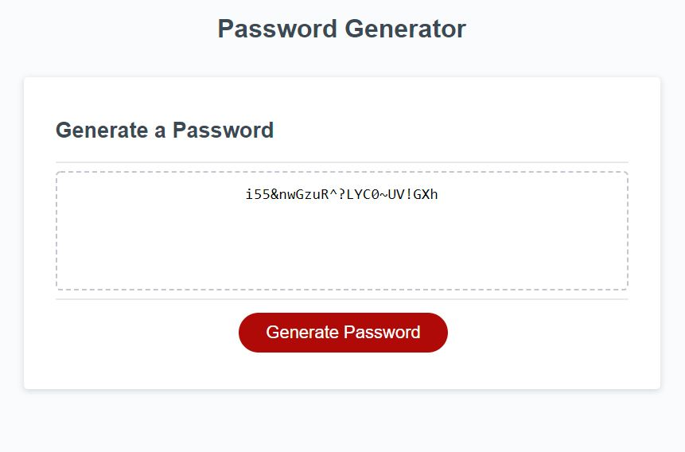

# Password Generator by Mark Kanczuzewski

The purpose of this exersize was to create an application that generates a random password based on user-selected criteria. The app runs in the browser and features dynamically updated HTML and CSS powered by your JavaScript code. It has a clean and polished user interface and is responsive, which ensures that it adapts to multiple screen sizes. The following are the critera for the exersize:

1. Generate a form using HTML and CSS to preset the user with a button for interaction to start the password generation process and display the resulting password to the user. 
2. Require the user to pick a password length from 8 to 128 characters. 
3. Present the user with a series of prompts with critera to generate the password including lowercase, uppercase, numeric, and special characters. 
4. Require the user to pick at least one of the critera in number 3. 
5. Send the password with the requirements gathered in numbers 2-4 back to the HTML form. 

Installation: This website is deployed at the following location:
https://mkanczuzewski.github.io/Module-3-Challenge-MRK-101721

Usage: This site is for educational purposesly only.

Credits: Mark Kanczuzewski

Copyright (c) [2021] [Mark Kanczuzewski]

Permission is hereby granted, free of charge, to any person obtaining a copy
of this software and associated documentation files (the "Software"), to deal
in the Software without restriction, including without limitation the rights
to use, copy, modify, merge, publish, distribute, sublicense, and/or sell
copies of the Software, and to permit persons to whom the Software is
furnished to do so, subject to the following conditions:

The above copyright notice and this permission notice shall be included in all
copies or substantial portions of the Software.

THE SOFTWARE IS PROVIDED "AS IS", WITHOUT WARRANTY OF ANY KIND, EXPRESS OR
IMPLIED, INCLUDING BUT NOT LIMITED TO THE WARRANTIES OF MERCHANTABILITY,
FITNESS FOR A PARTICULAR PURPOSE AND NONINFRINGEMENT. IN NO EVENT SHALL THE
AUTHORS OR COPYRIGHT HOLDERS BE LIABLE FOR ANY CLAIM, DAMAGES OR OTHER
LIABILITY, WHETHER IN AN ACTION OF CONTRACT, TORT OR OTHERWISE, ARISING FROM,
OUT OF OR IN CONNECTION WITH THE SOFTWARE OR THE USE OR OTHER DEALINGS IN THE
SOFTWARE.